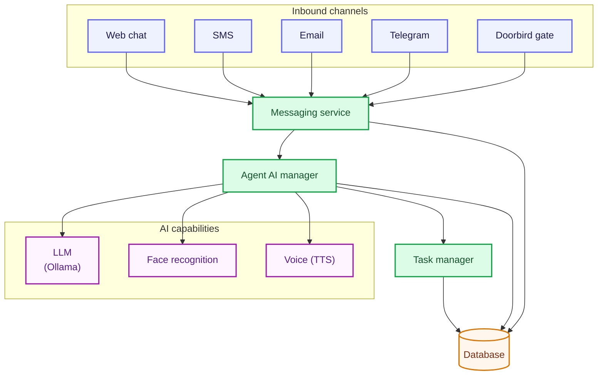
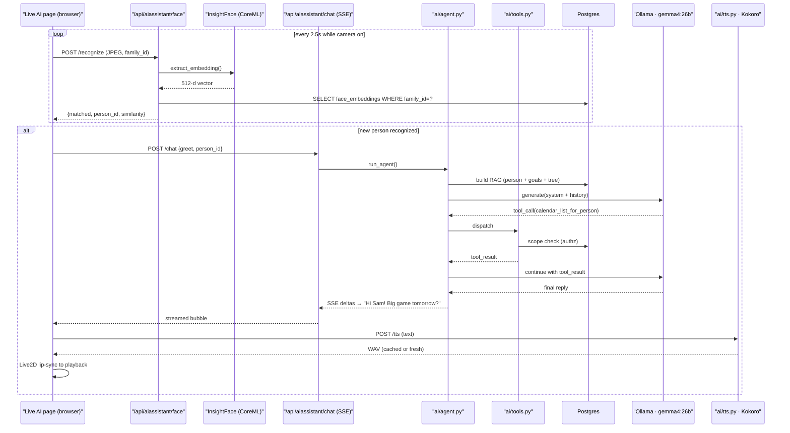

# Family Assistant

A fully local, privacy-preserving Family Assistant. A FastAPI + React
admin console captures your household's structured data (people,
relationships, goals, pets, residences, vehicles, insurance, finances,
documents, identity records) and a live AI assistant named **Avi** uses
that data — together with a local camera and local LLM — to recognize
family members by face, greet them by name, and answer questions with
full context about their goals, relationships, and belongings.

Nothing leaves the machine by default. Sensitive columns (SSNs, policy
numbers, account numbers, VINs, license plates) are encrypted at rest
with a Fernet key that only you hold. The only time data ever touches
the internet is the optional one-shot Gemini call that generates Avi's
avatar image.

## Overview

The project has three cooperating layers:

1. **Admin console** (`/admin/...`) — a React app for managing the
   family knowledge base. Every resource is full CRUD, with file uploads
   for photos and documents, and a live family-tree visualization on the
   dashboard. Admin API routes live under `/api/admin/*` so they can be
   guarded by a separate auth layer later.
2. **Live AI assistant** (`/aiassistant/:familyId`) — a standalone page
   that opens the webcam, runs continuous face recognition against the
   enrolled gallery, hands structured context ("who is in front of the
   camera, what are their goals, who are their siblings") to a local
   LLM, and streams the reply back into a chat panel. Recognized
   family members get an **instant spoken greeting** (no-LLM template
   → Kokoro-82M TTS, ~300 ms end-to-end) followed by a contextual
   LLM-generated follow-up question about their top goal — spoken out
   loud when the greeting finishes. A microphone toggle enables
   Web-Speech-API voice input, and a header speaker toggle mutes Avi.
   Avi himself is rendered on stage as a **rigged Live2D character**
   (Pixi.js + Cubism 4) — real lip-sync driven by the playing TTS
   clip, auto-blinking, hair/clothing physics, a wave-and-smile on
   greet, and pupils that follow the viewer's cursor. The Gemini-
   generated portrait still appears as a small badge in the corner.
3. **Shared backend** (`/api/*`) — FastAPI on top of SQLAlchemy 2.0 and
   Postgres. The schema is intentionally verbose and self-describing:
   every table and column carries a Postgres `COMMENT`, and a read-only
   `llm_schema_catalog` view lets a local LLM discover the schema when
   generating dynamic SQL.

## Architecture Diagram

A bird's-eye view. Every family member — whether they're standing in
front of the camera, texting, emailing, or chatting on Telegram —
lands on the same **messaging service**, which hands the conversation
to the **agent AI** to plan, call tools, and reply. Models all run
locally on the box; the only outbound traffic is to opt-in cloud APIs.



### Inbound surface matrix

| Surface | Trigger | Identity gate | Response path | Session row |
|---|---|---|---|---|
| **Live page** | `/api/aiassistant/chat` (SSE) or face match | family-scoped (single-machine trust) | streaming SSE deltas (+ optional fast-ack placeholder) | `live_sessions(source='live')`, idle 30 min |
| **SMS** | Twilio inbound webhook (signed) | `from` matches `people.mobile_phone_number` (E.164) | TwiML reply via Twilio | `live_sessions(source='sms', external_thread_id=<E.164>)`, never auto-closed |
| **Telegram** | bot long-poll, 25 s window | `message.from.id` ↔ `people.telegram_user_id` (or `@username`); unknowns get a one-tap "Share contact" prompt + SMS-2FA bind | `sendMessage` (+ optional fast-ack pre-message) | `live_sessions(source='telegram', external_thread_id=<chat_id>)` |
| **Email** | Gmail unread poll, 60 s | `From:` matches `people.email_address` | `users.messages.send` reply, threaded | `live_sessions(source='email', external_thread_id=<thread_id>)` |
| **Doorbird gate** | scaffold only (planned) | LAN device, no auth surface yet | open / ring | n/a |

### Request flow — "Avi, say hi to whoever walks in"



## Key Technologies

### Backend · Python 3.12, `uv`-managed

| Category | Package | Why |
|---|---|---|
| Web framework | **FastAPI** · `uvicorn[standard]` | Async HTTP, automatic OpenAPI, SSE streaming, lifespan-managed background tasks |
| ORM + migrations | **SQLAlchemy 2.0** · **Alembic** | Typed mapped classes, first-class `COMMENT ON` support, forward-only revisions |
| Database driver | `psycopg2-binary` | Postgres |
| Validation | **Pydantic v2** · `pydantic-settings` | Request/response schemas + `.env` loading |
| Encryption | `cryptography` (Fernet) | AES-128-CBC + HMAC-SHA256 for sensitive columns |
| File uploads | `python-multipart` · Pillow | Photo + document ingest |
| HTTP client | **`httpx`** | Streaming Ollama, Gmail, Calendar, Twilio, Telegram, Doorbird |
| Face recognition | **InsightFace** · `onnxruntime` · OpenCV | ArcFace 512-d embeddings, CoreML provider on Apple Silicon |
| Text-to-speech | **kokoro-onnx** · `soundfile` · `espeakng-loader` | Kokoro-82M neural voices, 24 kHz mono WAV, ONNX Runtime (~330 MB weights) |
| Concurrency | `asyncio` · `concurrent.futures.ThreadPoolExecutor` | Long-poll inbox loops on the event loop, heavy agent runs on a bounded background pool |
| Image gen (optional) | `google-genai` | Avatar generation for Avi's profile image |
| Google APIs | `google-auth` · `google-auth-oauthlib` · raw REST via `httpx` | Gmail send/list/get + Calendar free/busy + OAuth refresh |
| SMS | Twilio REST + signed webhooks (validated in-process) | Two-way SMS as a chat surface, plus the second factor for Telegram contact verification |
| Telegram | Bot API over `httpx` (no python-telegram-bot dep) | `getUpdates` long-poll, `sendMessage`, `request_contact`, file download |
| Door / gate | local `httpx` calls to a Doorbird IP | Open-gate intent (scaffold) |

### AI / agent layer

| Category | Component | Why |
|---|---|---|
| Heavy chat model | **`gemma4:26b`** via Ollama | Tool-using agent, multi-turn reasoning. Default for every surface. |
| Fast model | **`gemma4:e2b`** via Ollama (`/api/chat`, `think: false`) | 1-sentence contextual acknowledgments inside the 3-second race window so push surfaces never sit silent. |
| Agent loop | `ai/agent.py` | Plan/execute/observe loop, async generator that yields `task_started · step · delta · task_completed · task_failed` events to the SSE channel and writes one `agent_steps` row per emission. |
| Tool registry | `ai/tools.py` | 16 callable tools: `sql_query`, `lookup_person`, `reveal_sensitive_identifier`, `reveal_secret`, `gmail_send`, `calendar_list_upcoming`, `calendar_check_availability`, `calendar_find_free_slots`, `calendar_list_for_person`, `task_create / list / get / update / add_comment / add_follower`, `telegram_invite`. Each is a `Tool(name, description, parameters, handler, timeout, requires)`. |
| SQL sandbox | `ai/sql_tool.py` | Read-only Postgres role + statement-level guard; the model can write SELECTs against `llm_schema_catalog` without touching ciphertext. |
| Authz scope | `ai/authz.py` | Per-speaker access policy (self / spouse / parent / child / unauthorized) injected into every system prompt and re-checked inside sensitive tools. |
| RAG context | `ai/rag.py` · `ai/prompts.py` · `ai/schema_catalog.py` | Builds the household overview (people, goals, vehicles, residences, accounts) and the dynamic schema dump that lets the model write SQL on the fly. |
| Fast-ack | `ai/fast_ack.py` + `services/background_agent.py` | Surface-agnostic latency hider. Telegram + SMS submit the heavy run to a shared `ThreadPoolExecutor` and call `generate_contextual_ack_sync`; the live `/chat` SSE handler races the agent on the event loop with `generate_contextual_ack_async`. Either way, if the heavy model hasn't started replying after `AI_FAST_ACK_AFTER_SECONDS` (default 3 s), `gemma4:e2b` mints a one-sentence ack ("Looking up Sara's calendar.") that's delivered as a Telegram pre-message / SMS pre-message / SSE `fast_ack` event before the real reply. |
| Inbox pollers | `services/email_inbox.py` · `services/telegram_inbox.py` | Long-poll loops started from FastAPI's `lifespan`. Each maintains its own dedup, audit-row writes, and per-thread `LiveSession`. |
| SMS surface | `routers/sms_webhook.py` · `services/sms_inbox.py` | Twilio inbound webhook (signature verified) → person lookup → agent loop → TwiML reply. |

### Frontend avatar rendering

| Category | Package | Why |
|---|---|---|
| 2D character | **Live2D Cubism 4** runtime (self-hosted) · `pixi.js@7` · `pixi-live2d-display-lipsyncpatch` | Rigged character with real lip-sync, auto-blink, breathing + hair physics, greet/tap motions, pupil tracking |
| Starter model | **Natori** (Live2D Inc., Free Material License) | Bundled under `ui/react/public/live2d/natori/`. Swap in any other Cubism 4 model by dropping its folder next to Natori's and updating the constants at the top of `AiAssistantPage.tsx`. |
| SVG mouth fallback | Inline component `SpeakingMouth.tsx` | Real amplitude-driven lip-sync *without* Live2D — used on mobile browsers, when the Cubism runtime fails to load, or while the rigged model is still downloading. Morphs a single path between closed, open, and smiling shapes, with a teeth hint on louder syllables. |

### Frontend · Node, Vite

| Category | Package | Why |
|---|---|---|
| Build tool | **Vite** | Fast HMR, `/api` proxy in dev |
| Framework | **React 18** · **TypeScript** | Type-safe components |
| Routing | `react-router-dom` | `/admin/...` and `/aiassistant/...` roots |
| Data fetching | **@tanstack/react-query** | Cache, invalidation, optimistic UI |
| Forms | `react-hook-form` | Minimal-rerender form state |
| Styling | **Tailwind CSS** · shadcn-style components | Utility-first UI |
| Icons | `lucide-react` | Consistent icon set |

### Local AI daemons

| | |
|---|---|
| **Ollama** | Serves both LLMs on `localhost:11434`. Heavy model `AI_OLLAMA_MODEL` (default `gemma4:26b`) drives the agent; lightweight `AI_OLLAMA_FAST_MODEL` (default `gemma4:e2b`) generates fast acks and other structured one-shots. Ollama serializes per-loaded-model unless `OLLAMA_NUM_PARALLEL>1`; idle models unload after 5 min by default (`keep_alive`). |
| **InsightFace (buffalo_l)** | Face detection + 512-d ArcFace embeddings. First run downloads ~300 MB into `~/.insightface/`. Uses CoreML provider when `AI_MAC_STUDIO_OPTIMIZED=true` (default). |
| **Kokoro-82M (kokoro-onnx)** | Neural text-to-speech for Avi's spoken greetings + follow-up questions. Weights (~330 MB total: `kokoro-v1.0.onnx` + `voices-v1.0.bin`) are lazy-downloaded on first `/api/aiassistant/tts` call into `resources/models/kokoro/`. Cached synthesis results live in `resources/family/tts_cache/` so repeat phrases return in ~8 ms. Voice is picked from the assistant's `gender` (female → `af_bella`, male → `am_adam`) or forced via `AI_TTS_VOICE`. |

## Running

Once dependencies are installed and migrations applied, the app runs as
two processes plus the Ollama daemon. The managed scripts under
`scripts/` take care of PID tracking, log files, and health probes so
you don't have to juggle three terminals.

| Service | URL | Managed by |
|---|---|---|
| Backend API | <http://localhost:8000> (docs at `/docs`) | `scripts/start.sh` → `.run/backend.pid` |
| Frontend dev server | <http://localhost:5173> | `scripts/start.sh` → `.run/frontend.pid` |
| Ollama daemon | <http://localhost:11434> | managed separately (`ollama serve`) |

### Managed scripts

All scripts live in `scripts/`, print timestamped output, and store
state under `.run/` (PIDs) and `logs/` (stdout + stderr). Both
directories are git-ignored.

```bash
scripts/deploy.sh                # one-shot: uv sync + npm install + alembic upgrade
scripts/deploy.sh --build        # also produce a production frontend bundle
scripts/deploy.sh --clean        # wipe .venv and node_modules first

scripts/start.sh                 # start backend + frontend (waits for health)
scripts/start.sh backend         # start just one service
scripts/start.sh --force         # kill orphans on :8000/:5173 before starting

scripts/stop.sh                  # graceful SIGTERM (then SIGKILL fallback)
scripts/stop.sh --force          # also sweep anything still bound to the ports

scripts/restart.sh               # stop --force + start
scripts/restart.sh backend       # restart a single service

tail -f logs/backend.log logs/frontend.log
```

Typical daily flow: `scripts/start.sh` in the morning, `scripts/restart.sh`
after pulling new commits, `scripts/stop.sh` at end of day. The sidebar's
purple "Live AI Assistant" button jumps straight to
`/aiassistant/:familyId` for the currently-selected family.

### Stopping background services (rarely needed)

```bash
scripts/stop.sh --force                 # app services only
brew services stop postgresql@16        # fully stop Postgres
pkill -f 'ollama serve'                 # fully stop Ollama
```

## Syncing

After pulling new commits, refresh every layer so schema + deps match:

```bash
git pull

# 1. Python deps (adds/removes/updates packages per pyproject.toml)
uv sync

# 2. Node deps
cd ui/react && npm install && cd -

# 3. Database schema (forward-only; safe to run repeatedly)
uv run alembic upgrade head

# 4. Face embeddings for newly uploaded photos enroll automatically via a
#    background task (see step 8 of Initial Setup). Run this only if you
#    imported photos directly into the DB or want to force a full
#    re-enroll of every flagged photo that's missing an embedding.
# curl -s -X POST 'http://localhost:8000/api/aiassistant/face/enroll?family_id=1'
```

If the backend was already running, restart it so freshly added routers
and config changes are picked up (Uvicorn's `--reload` sometimes misses
new modules):

```bash
lsof -ti :8000 | xargs -r kill -9
uv run uvicorn api.main:app --app-dir python --reload
```

## Installing Dependencies

Day-to-day dependency management:

```bash
# ── Python ───────────────────────────────────────────────
# add a runtime dep
uv add some-package

# add a dev-only dep
uv add --group dev some-tool

# remove a dep
uv remove some-package

# sync your environment to pyproject.toml exactly
uv sync

# ── Node (frontend) ──────────────────────────────────────
cd ui/react
npm install some-package                 # runtime
npm install --save-dev some-tool         # dev-only
npm uninstall some-package
```

### Optional: pull the local LLM

```bash
# default expected model (matches AI_OLLAMA_MODEL in .env)
ollama pull gemma4

# or a specific size/tag
ollama pull gemma3:27b
```

Pick something that fits your RAM. On an M-series Mac, `gemma3:4b` is a
good daily driver; `gemma3:27b` or larger shines on a Mac Studio.

## Initial Setup

Run these one-time steps on a fresh clone.

### 1. Command-line tools

```bash
xcode-select --install
```

### 2. Python (backend) — `uv`

```bash
brew install uv
uv python pin 3.12
uv sync
```

### 3. Postgres

```bash
brew install postgresql@16
brew services start postgresql@16

# one-time role + database
createuser -s family_assistant
createdb -O family_assistant family_assistant
psql -d family_assistant -c "ALTER USER family_assistant WITH PASSWORD 'Avi123!';"
```

Connection settings live in `.env` as `FA_DB_HOST`, `FA_DB_PORT`,
`FA_DB_USER`, `FA_DB_PWD`, `FA_DB_NAME`.

### 4. Node (frontend)

```bash
brew install node
cd ui/react && npm install
```

### 5. Ollama + local LLM

```bash
brew install ollama
ollama serve &                   # starts the daemon
ollama pull gemma4               # or gemma3, gemma3:27b, etc.
```

### 6. Configure secrets in `.env`

Generate a Fernet key for encrypting sensitive columns:

```bash
uv run python -c "from cryptography.fernet import Fernet; print(Fernet.generate_key().decode())"
```

Paste it into `.env` as `FA_ENCRYPTION_KEY`. **Never commit `.env`.** If
you lose the key you will not be able to decrypt existing SSNs, policy
numbers, VINs, or account numbers.

Example `.env` layout:

```ini
FA_DB_HOST=localhost
FA_DB_PORT=5432
FA_DB_USER=family_assistant
FA_DB_PWD=Avi123!
FA_DB_NAME=family_assistant
FA_ENCRYPTION_KEY=<paste-generated-fernet-key-here>
FA_STORAGE_ROOT=./resources/family
FA_CORS_ORIGINS=http://localhost:5173

# Optional: Gemini avatar generation for the assistant profile image
GEMINI_API_KEY=
GEMINI_PROJECT_ID=

# Local AI assistant (Avi)
AI_OLLAMA_HOST=http://localhost:11434
AI_OLLAMA_MODEL=gemma4:26b
AI_FACE_MATCH_THRESHOLD=0.40
AI_MAC_STUDIO_OPTIMIZED=true

# Text-to-speech (Kokoro-82M). First `/tts` call lazy-downloads ~330 MB.
AI_TTS_ENABLED=true
AI_TTS_ENGINE=kokoro
# "auto" lets the assistant's gender pick the voice pack. Override
# with any Kokoro voice name (af_bella, af_nicole, am_adam, bm_lewis, ...).
AI_TTS_VOICE=auto
AI_TTS_SPEED=1.0
AI_TTS_MODEL_DIR=./resources/models/kokoro
```

### 6b. Google OAuth (Avi's Gmail + Calendar)

This is optional but unlocks two big things for Avi: sending email
from his own Gmail address, and reading any calendar shared with him
(including yours, for free/busy lookups). It works entirely on
`http://localhost` — no public domain, no tunnel, no app verification.

1. **Create the Google account Avi will use.** A regular gmail.com
   address is fine. You can also use a Google Workspace address.

2. **Spin up a Google Cloud project** (one-time, free tier is enough):
   - Go to <https://console.cloud.google.com/> → create a new project,
     e.g. `family-assistant`.
   - **APIs & Services → Library** → enable **Gmail API** and
     **Google Calendar API**.

3. **Configure the OAuth consent screen:**
   - **APIs & Services → OAuth consent screen** → User type =
     **External**.
   - App name = `Family Assistant (local)`, user support email = you.
   - **Scopes:** add `gmail.send` and `calendar.readonly` (the rest —
     `openid`, `email`, `profile` — are non-sensitive and are added
     automatically).
   - **Test users:** add Avi's gmail and your own. While the app is
     in "Testing" mode (the default) only listed test users can log in,
     and you don't need Google's app review.

4. **Create the OAuth client:**
   - **APIs & Services → Credentials → Create credentials → OAuth
     client ID**.
   - Application type = **Web application**.
   - Authorized redirect URIs: add exactly
     `http://localhost:8000/api/admin/google/oauth/callback`.
   - Save and copy the client id + client secret into `.env`:

   ```ini
   GOOGLE_OAUTH_CLIENT_ID=<paste here>.apps.googleusercontent.com
   GOOGLE_OAUTH_CLIENT_SECRET=<paste here>
   GOOGLE_OAUTH_REDIRECT_URI=http://localhost:8000/api/admin/google/oauth/callback
   GOOGLE_OAUTH_POST_LOGIN_REDIRECT=http://localhost:5173/admin
   ```

5. **Restart the API** (`./start-services.sh`) and open the admin
   console → **Assistant** page. The "Google account" card shows a
   **Connect with Google** button. Click it, sign in as Avi, and
   approve the scopes. You'll land back on the admin page with a
   green confirmation toast.

6. **Test it.** The same card has two smoke-test buttons:
   - **Send test email to self** — proves the Gmail scope works.
   - **Show next 72h of events** — proves the Calendar scope works.

7. **Share your personal calendar with Avi** so he can see your
   schedule:
   <https://calendar.google.com/> → your calendar → Settings → Share
   with specific people → add Avi's gmail with permission **See all
   event details** (or **Free/busy** if you don't want titles
   exposed). Avi will then see your events alongside his own when he
   queries the calendar.

Tokens are stored Fernet-encrypted in the
`google_oauth_credentials` table. Refresh tokens never leave the
server, and the only plaintext columns are the granted email,
scopes, and access-token expiry (kept plain so the admin UI can
render a status badge without decryption).

**Important — token lifetime.** Google issues two tokens: an
**access_token** (1-hour TTL — what the UI shows under "Access
token rotates") and a long-lived **refresh_token** (used silently
to mint new access tokens before each call, so you never see the
1-hour rotation). For sensitive scopes like `gmail.send` and
`calendar.readonly`, **the refresh_token's lifetime depends on
your OAuth consent screen publishing status**:

| Status | Refresh token lifetime |
| --- | --- |
| **Testing** (default) | **7 days** — you'll have to reconnect each week |
| **In production**, unverified | Indefinite (until revoked or 6 months idle) |
| **In production**, verified | Indefinite |

For a local personal tool, **publish the app to Production** to
escape the 7-day cap. You don't need to complete Google's
verification process — Google only blocks *third-party* users from
unverified apps; the app owner can always click "Advanced → Go to
(unsafe)" past the warning. Steps:

1. Visit <https://console.cloud.google.com/apis/credentials/consent>
2. In the "Publishing status" card click **Publish App** → confirm.
3. Disconnect + reconnect from the admin UI. The new refresh token
   issued under Production status is good indefinitely.

### 7. Run database migrations

```bash
uv run alembic upgrade head
```

This creates every table and a read-only `llm_schema_catalog` view that
exposes each table/column along with its natural-language description.
A local LLM can `SELECT * FROM llm_schema_catalog` to discover the
schema when generating dynamic SQL.

### 8. Enroll faces (usually automatic)

Uploading a photo through the admin console with **"Use for face
recognition"** ticked **automatically schedules a background task** that
extracts an InsightFace embedding and writes it to `face_embeddings`.
The same is true for toggling the flag on/off on an existing photo, and
cascade-deletes take care of cleanup when a photo is removed. You
usually don't need to do anything — the Live AI page's face-status
badge will tick up from "N faces" to "N+1 faces" a few seconds after
the upload.

For bulk backfill (e.g. after importing photos straight into the
database, or on a fresh install where the InsightFace model pack needs
to download), kick off a one-shot full-family enrollment pass:

```bash
curl -s -X POST 'http://localhost:8000/api/aiassistant/face/enroll?family_id=1'
```

That walks every flagged photo that doesn't already have an embedding
and processes them in a single request.

### 9. Warm up the voice (optional, first run only)

The first `POST /api/aiassistant/tts` call downloads the Kokoro-82M
ONNX weights + voice pack (~330 MB) into `resources/models/kokoro/`
and initializes the inference session. Everything after is cached;
identical phrases re-play in ~8 ms and fresh syntheses land in ~300 ms
on an M-series Mac. To pre-warm so a family member doesn't stare at a
silent greeting on your very first camera test:

```bash
curl -s -X POST http://localhost:8000/api/aiassistant/tts \
  -H 'Content-Type: application/json' \
  -d '{"text":"Hello, I am Avi."}' \
  --output /tmp/hello.wav
afplay /tmp/hello.wav   # macOS
```

### 10. Live2D character assets

Avi's rigged body on the live page comes from the free **Natori**
model shipped by Live2D Inc. under their
[Free Material License](https://www.live2d.com/en/terms/live2d-free-material-license-agreement/).
The model files (moc3, textures, physics, motions, expressions) live
under `ui/react/public/live2d/natori/` and are served statically by
Vite. The proprietary Cubism 4 Core JS runtime
(`live2dcubismcore.min.js`, ~200 KB) is **self-hosted** alongside the
model — it's redistributable under Live2D's Proprietary Software
License (see `public/live2d/CORE_LICENSE.md`). No npm install, no CDN
dependency, works offline on the Mac Studio.

If the Cubism runtime or the model files can't load for any reason
(older mobile browser, corporate firewall, offline dev), the stage
automatically degrades to an **animated SVG fallback**: the Gemini
portrait with a real amplitude-driven mouth overlay and a smile curve
on greetings. Kids still see Avi talking and smiling, just without the
hair physics / pupil tracking / idle motions. The mode is shown in the
header as `Avatar: live` (Live2D) vs `Avatar: SVG fallback`.

To **swap characters**:

1. Download any Cubism 4 sample from
   [`Live2D/CubismWebSamples`](https://github.com/Live2D/CubismWebSamples/tree/develop/Samples/Resources)
   or a ready-made model from Nizima / BOOTH.
2. Drop the folder under `ui/react/public/live2d/<name>/`.
3. Update the two constants at the top of
   `ui/react/src/pages/AiAssistantPage.tsx`:

   ```ts
   const AVI_LIVE2D_MODEL_PATH = "<name>";           // folder
   const AVI_LIVE2D_MODEL_FILE = "<Name>.model3.json"; // entry file
   ```

If the Cubism runtime fails to load (offline, CSP blocking) or a model
is missing, `AviLive2D` silently falls back to the static Gemini
portrait with the existing CSS-driven mouth-pulse + wave animations,
so the live page never breaks.

---

## Data model (LLM-friendly)

Table and column names are **verbose natural-language snake_case**, and
every table/column has a Postgres `COMMENT` describing what it holds.
This makes dynamic SQL generation by a local LLM reliable — the LLM can
read `llm_schema_catalog` and see things like:

- `people.primary_family_relationship` — "spouse, child, parent, …"
  (convenience label — the authoritative tree lives in
  `person_relationships`).
- `person_relationships.relationship_type` — atomic edges: `parent_of`
  (directional) and `spouse_of` (symmetric); siblings/cousins/etc. are
  derived.
- `person_photos.use_for_face_recognition` — flags which photos Avi
  should use for enrollment.
- `goals.priority` — `urgent · semi_urgent · normal · low`; surfaced in
  every RAG prompt so Avi can ask specific, fresh follow-up questions.
- `insurance_policies.policy_type` — `auto, home, renters, health, …`.
- `vehicles.registration_expiration_date` — "Used by Avi to proactively
  warn …".

For a complete table-by-table walkthrough — including the AI surfaces
(`live_sessions`, `agent_tasks`, the inbox-message audit tables, the
Telegram invite + verification tables, etc.) and an ER-style diagram of
how the pieces hang together — see **[`docs/DATA_MODEL.md`](docs/DATA_MODEL.md)**.

Tables today, grouped by domain:

- **Family core** — `families`, `assistants`, `people`,
  `person_relationships`, `person_photos`, `face_embeddings`, `goals`.
- **Health** — `medical_conditions`, `medications`, `physicians`.
- **Household assets** — `pets`, `pet_photos`, `residences`,
  `residence_photos`, `addresses`, `vehicles`, `insurance_policies`,
  `insurance_policy_people`, `insurance_policy_vehicles`,
  `financial_accounts`, `documents`.
- **Identity (encrypted)** — `identity_documents`,
  `sensitive_identifiers`.
- **AI conversation surfaces** — `live_sessions`,
  `live_session_participants`, `live_session_messages`.
- **Inbox audit** — `email_inbox_messages`, `sms_inbox_messages`,
  `sms_inbox_attachments`, `telegram_inbox_messages`,
  `telegram_inbox_attachments`.
- **Telegram onboarding** — `telegram_invites` (deep-link claims),
  `telegram_contact_verifications` (SMS-2FA for contact-share linking).
- **Tasks (kanban)** — `tasks`, `task_comments`, `task_followers`,
  `task_attachments`.
- **Agent audit** — `agent_tasks`, `agent_steps`.
- **External-service credentials** — `google_oauth_credentials`
  (Fernet-encrypted refresh tokens for Gmail + Calendar).

## Encryption of sensitive columns

- Sensitive values (SSN, policy numbers, account/routing numbers, VINs,
  license plates, ID document numbers) are encrypted at the application
  layer with **Fernet** (AES-128-CBC + HMAC-SHA256) using
  `FA_ENCRYPTION_KEY`.
- Ciphertext is stored in `*_encrypted` `bytea` columns. The plaintext
  is **never** logged, returned from the API, or usable from SQL.
- For display and for LLM-generated SQL filters we keep a paired
  plaintext `*_last_four` column (e.g. `policy_number_last_four`,
  `account_number_last_four`). The LLM writes queries like
  `WHERE policy_number_last_four = '1234'` without ever touching
  ciphertext.

## Repository layout

```
family-assistant/
├── python/api/                    FastAPI backend
│   ├── main.py                    route mounting + lifespan (email + telegram pollers)
│   ├── config.py                  pydantic-settings (DB, Fernet, Ollama, Twilio, Telegram, face/TTS, fast-ack)
│   ├── db.py                      SQLAlchemy 2.0 engine + session
│   ├── crypto.py                  Fernet helpers
│   ├── storage.py                 filesystem uploads under resources/family/<family_id>/...
│   ├── utils/                     phone normalisation, etc.
│   ├── models/                    one ORM class per table, every column has comment=
│   ├── schemas/                   Pydantic request/response shapes (never expose ciphertext)
│   ├── routers/                   one FastAPI router per resource
│   │   ├── families · people · person_photos · person_relationships
│   │   ├── goals · medical_conditions · medications · physicians
│   │   ├── pets · pet_photos · residences · residence_photos · addresses
│   │   ├── vehicles · insurance_policies · financial_accounts · documents
│   │   ├── identity_documents · sensitive_identifiers · assistants
│   │   ├── tasks · google · status · legal · media
│   │   ├── ai_chat · ai_face · ai_tts · live_sessions · agent_tasks
│   │   └── sms_webhook            (public Twilio inbound)
│   ├── ai/
│   │   ├── agent.py               plan/execute/observe loop, SSE event stream
│   │   ├── tools.py               16 callable tools (SQL, calendar, email, tasks, ...)
│   │   ├── sql_tool.py            sandboxed read-only SQL
│   │   ├── authz.py               per-speaker scope + sensitive-tool guard
│   │   ├── ollama.py              httpx client (heavy + fast model)
│   │   ├── fast_ack.py            gemma4:e2b 1-sentence ack via /api/chat (sync + async entry points)
│   │   ├── prompts.py · rag.py · schema_catalog.py    system-prompt + RAG builders
│   │   ├── session.py             find_or_create per-surface LiveSession
│   │   ├── face.py · enrollment.py InsightFace wrapper, embedding cache, cosine match
│   │   └── tts.py                 Kokoro-82M ONNX, voice by gender, disk cache
│   ├── services/
│   │   ├── email_inbox.py         Gmail long-poll loop (lifespan task)
│   │   ├── telegram_inbox.py      Telegram getUpdates loop + per-update agent dispatch
│   │   ├── sms_inbox.py           inbound SMS pipeline (called by sms_webhook router)
│   │   ├── background_agent.py    shared ThreadPoolExecutor for fast-ack race
│   │   └── system_status.py       /api/aiassistant/status payload builder
│   ├── integrations/
│   │   ├── gmail.py · google_calendar.py · google_oauth.py    Google APIs
│   │   ├── telegram.py            Bot API client (sendMessage, getUpdates, files)
│   │   ├── twilio_sms.py          Twilio REST + signature verification
│   │   ├── doorbird_gate.py       LAN gate intent (scaffold)
│   │   └── gemini.py              optional avatar image generation
│   └── migrations/                Alembic revisions
├── ui/react/                      Vite + React + TS admin console + AI page
│   └── src/
│       ├── App.tsx                route tree (/admin/..., /aiassistant/:id)
│       ├── lib/api.ts             fetch wrapper + resolveApiPath rewriting
│       ├── components/            Layout, Modal, PageHeader, Toast, Live2D bits, etc.
│       └── pages/
│           ├── FamiliesList, FamilyDashboard, FamilySettings
│           ├── PeoplePage, PersonDetail, RelationshipsPage
│           ├── MedicalPage, MedicationsPage, PhysiciansPage
│           ├── PetsPage, ResidencesPage, VehiclesPage
│           ├── InsurancePoliciesPage, FinancialAccountsPage, DocumentsPage
│           ├── TasksPage, AgentTasksPage   (kanban + agent run audit)
│           ├── AssistantPage               (admin Avi config + Google OAuth)
│           └── AiAssistantPage             (live /aiassistant/:familyId)
├── docs/                          long-form docs (DATA_MODEL.md, ...)
├── resources/family/              uploaded photos + documents + tts_cache (gitignored)
├── resources/models/              Kokoro ONNX weights (gitignored)
├── alembic.ini                    migration config
├── pyproject.toml                 Python deps, managed by uv
└── .env                           DB + Fernet + Ollama + Twilio + Telegram + Google secrets (gitignored)
```

## Common operations

```bash
# create a new migration after editing models
uv run alembic revision --autogenerate -m "describe your change"
uv run alembic upgrade head

# roll back one revision
uv run alembic downgrade -1

# browse the API (Swagger UI)
open http://localhost:8000/docs

# inspect the LLM schema catalog
psql -U family_assistant -d family_assistant \
  -c "SELECT table_name, column_name, column_description FROM llm_schema_catalog;"

# re-enroll all recognition photos for a family
curl -s -X POST 'http://localhost:8000/api/aiassistant/face/enroll?family_id=1'

# clear recognition gallery and start over
curl -s -X DELETE 'http://localhost:8000/api/aiassistant/face/enroll?family_id=1'

# quick health probe
curl -s http://localhost:8000/api/health
curl -s http://localhost:8000/api/aiassistant/status | python3 -m json.tool
```

## Roadmap

- **Voice output.** Plumb Avi's replies through a local TTS (e.g.
  Piper, Coqui, or macOS `say`) so greetings are spoken, not just
  rendered.
- **Wake word.** Replace the manual mic toggle with always-on local
  wake-word detection ("Hey Avi").
- **Tool-use / SQL agent.** Let Avi generate parameterized SQL against
  `llm_schema_catalog` with a decrypt-by-id tool for the handful of
  legitimate plaintext cases.
- **Email / research / spreadsheet automations**: delegated to Claude
  Code via tool invocations from the assistant.
- **Multi-user auth / per-person access policies.** Today the app
  assumes local single-machine trust; the `/api/admin/*` vs
  `/api/aiassistant/*` split is already in place to guard them
  separately.
