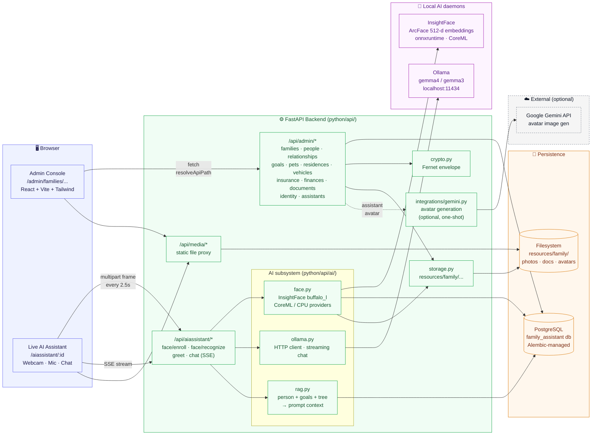
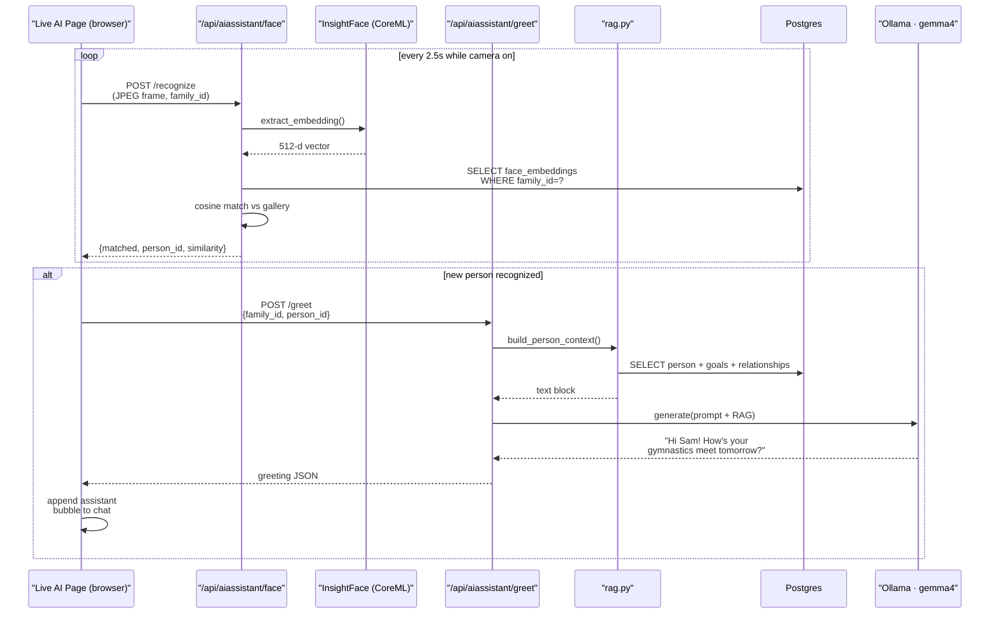

# Family Assistant

A fully local, privacy-preserving Family Assistant. A FastAPI + React
admin console captures your household's structured data (people,
relationships, goals, pets, residences, vehicles, insurance, finances,
documents, identity records) and a live AI assistant named **Avi** uses
that data — together with a local camera and local LLM — to recognize
family members by face, greet them by name, and answer questions with
full context about their goals, relationships, and belongings.

Nothing leaves the machine by default. Sensitive columns (SSNs, policy
numbers, account numbers, VINs, license plates) are encrypted at rest
with a Fernet key that only you hold. The only time data ever touches
the internet is the optional one-shot Gemini call that generates Avi's
avatar image.

## Overview

The project has three cooperating layers:

1. **Admin console** (`/admin/...`) — a React app for managing the
   family knowledge base. Every resource is full CRUD, with file uploads
   for photos and documents, and a live family-tree visualization on the
   dashboard. Admin API routes live under `/api/admin/*` so they can be
   guarded by a separate auth layer later.
2. **Live AI assistant** (`/aiassistant/:familyId`) — a standalone page
   that opens the webcam, runs continuous face recognition against the
   enrolled gallery, hands structured context ("who is in front of the
   camera, what are their goals, who are their siblings") to a local
   LLM, and streams the reply back into a chat panel. A microphone
   toggle enables Web-Speech-API voice input.
3. **Shared backend** (`/api/*`) — FastAPI on top of SQLAlchemy 2.0 and
   Postgres. The schema is intentionally verbose and self-describing:
   every table and column carries a Postgres `COMMENT`, and a read-only
   `llm_schema_catalog` view lets a local LLM discover the schema when
   generating dynamic SQL.

## Architecture Diagram



### Request flow — "Avi, say hi to whoever walks in"



## Key Technologies

### Backend · Python 3.12, `uv`-managed

| Category | Package | Why |
|---|---|---|
| Web framework | **FastAPI** · `uvicorn[standard]` | Async HTTP, automatic OpenAPI, SSE streaming |
| ORM + migrations | **SQLAlchemy 2.0** · **Alembic** | Typed mapped classes, first-class `COMMENT ON` support |
| Database driver | `psycopg2-binary` | Postgres |
| Validation | **Pydantic v2** · `pydantic-settings` | Request/response schemas + `.env` loading |
| Encryption | `cryptography` (Fernet) | AES-128-CBC + HMAC-SHA256 for sensitive columns |
| File uploads | `python-multipart` · Pillow | Photo + document ingest |
| Face recognition | **InsightFace** · `onnxruntime` · OpenCV | ArcFace 512-d embeddings, CoreML provider on Apple Silicon |
| Local LLM client | `httpx` | Streaming Ollama HTTP client |
| Image gen (optional) | `google-genai` | Avatar generation for Avi's profile image |

### Frontend · Node, Vite

| Category | Package | Why |
|---|---|---|
| Build tool | **Vite** | Fast HMR, `/api` proxy in dev |
| Framework | **React 18** · **TypeScript** | Type-safe components |
| Routing | `react-router-dom` | `/admin/...` and `/aiassistant/...` roots |
| Data fetching | **@tanstack/react-query** | Cache, invalidation, optimistic UI |
| Forms | `react-hook-form` | Minimal-rerender form state |
| Styling | **Tailwind CSS** · shadcn-style components | Utility-first UI |
| Icons | `lucide-react` | Consistent icon set |

### Local AI daemons

| | |
|---|---|
| **Ollama** | Serves the chat LLM on `localhost:11434`. Default model is `gemma4`; any Ollama-compatible model works via `AI_OLLAMA_MODEL`. |
| **InsightFace (buffalo_l)** | Face detection + 512-d ArcFace embeddings. First run downloads ~300 MB into `~/.insightface/`. Uses CoreML provider when `AI_MAC_STUDIO_OPTIMIZED=true` (default). |

## Running

Once dependencies are installed and migrations applied, the app runs as
two processes plus the Ollama daemon. Keep them in three separate
terminals (or `tmux` panes) during active development.

| Service | URL | Command |
|---|---|---|
| Backend API | <http://localhost:8000> (docs at `/docs`) | `uv run uvicorn api.main:app --app-dir python --reload` |
| Frontend dev server | <http://localhost:5173> | `cd ui/react && npm run dev` |
| Ollama daemon | <http://localhost:11434> | `ollama serve` (auto-starts on macOS) |

### Starting

```bash
# 1. ensure Postgres + Ollama are running
brew services start postgresql@16
ollama serve &                       # no-op if already running

# 2. start the backend (terminal 1)
cd /path/to/family-assistant
uv run uvicorn api.main:app --app-dir python --reload

# 3. start the frontend (terminal 2)
cd /path/to/family-assistant/ui/react
npm run dev

# 4. open the app
open http://localhost:5173
```

The sidebar's purple "Live AI Assistant" button jumps straight to
`/aiassistant/:familyId` for the currently-selected family.

### Stopping

```bash
# stop the dev servers: Ctrl-C in each terminal, or by port
lsof -ti :8000  | xargs -r kill -9   # FastAPI
lsof -ti :5173  | xargs -r kill -9   # Vite

# stop background services (only if you want them fully off)
brew services stop postgresql@16
pkill -f 'ollama serve'
```

## Syncing

After pulling new commits, refresh every layer so schema + deps match:

```bash
git pull

# 1. Python deps (adds/removes/updates packages per pyproject.toml)
uv sync

# 2. Node deps
cd ui/react && npm install && cd -

# 3. Database schema (forward-only; safe to run repeatedly)
uv run alembic upgrade head

# 4. Re-enroll face embeddings if new recognition photos were added
curl -s -X POST 'http://localhost:8000/api/aiassistant/face/enroll?family_id=1'
```

If the backend was already running, restart it so freshly added routers
and config changes are picked up (Uvicorn's `--reload` sometimes misses
new modules):

```bash
lsof -ti :8000 | xargs -r kill -9
uv run uvicorn api.main:app --app-dir python --reload
```

## Installing Dependencies

Day-to-day dependency management:

```bash
# ── Python ───────────────────────────────────────────────
# add a runtime dep
uv add some-package

# add a dev-only dep
uv add --group dev some-tool

# remove a dep
uv remove some-package

# sync your environment to pyproject.toml exactly
uv sync

# ── Node (frontend) ──────────────────────────────────────
cd ui/react
npm install some-package                 # runtime
npm install --save-dev some-tool         # dev-only
npm uninstall some-package
```

### Optional: pull the local LLM

```bash
# default expected model (matches AI_OLLAMA_MODEL in .env)
ollama pull gemma4

# or a specific size/tag
ollama pull gemma3:27b
```

Pick something that fits your RAM. On an M-series Mac, `gemma3:4b` is a
good daily driver; `gemma3:27b` or larger shines on a Mac Studio.

## Initial Setup

Run these one-time steps on a fresh clone.

### 1. Command-line tools

```bash
xcode-select --install
```

### 2. Python (backend) — `uv`

```bash
brew install uv
uv python pin 3.12
uv sync
```

### 3. Postgres

```bash
brew install postgresql@16
brew services start postgresql@16

# one-time role + database
createuser -s family_assistant
createdb -O family_assistant family_assistant
psql -d family_assistant -c "ALTER USER family_assistant WITH PASSWORD 'Avi123!';"
```

Connection settings live in `.env` as `FA_DB_HOST`, `FA_DB_PORT`,
`FA_DB_USER`, `FA_DB_PWD`, `FA_DB_NAME`.

### 4. Node (frontend)

```bash
brew install node
cd ui/react && npm install
```

### 5. Ollama + local LLM

```bash
brew install ollama
ollama serve &                   # starts the daemon
ollama pull gemma4               # or gemma3, gemma3:27b, etc.
```

### 6. Configure secrets in `.env`

Generate a Fernet key for encrypting sensitive columns:

```bash
uv run python -c "from cryptography.fernet import Fernet; print(Fernet.generate_key().decode())"
```

Paste it into `.env` as `FA_ENCRYPTION_KEY`. **Never commit `.env`.** If
you lose the key you will not be able to decrypt existing SSNs, policy
numbers, VINs, or account numbers.

Example `.env` layout:

```ini
FA_DB_HOST=localhost
FA_DB_PORT=5432
FA_DB_USER=family_assistant
FA_DB_PWD=Avi123!
FA_DB_NAME=family_assistant
FA_ENCRYPTION_KEY=<paste-generated-fernet-key-here>
FA_STORAGE_ROOT=./resources/family
FA_CORS_ORIGINS=http://localhost:5173

# Optional: Gemini avatar generation for the assistant profile image
GEMINI_API_KEY=
GEMINI_PROJECT_ID=

# Local AI assistant (Avi)
AI_OLLAMA_HOST=http://localhost:11434
AI_OLLAMA_MODEL=gemma4
AI_FACE_MATCH_THRESHOLD=0.40
AI_MAC_STUDIO_OPTIMIZED=true
```

### 7. Run database migrations

```bash
uv run alembic upgrade head
```

This creates every table and a read-only `llm_schema_catalog` view that
exposes each table/column along with its natural-language description.
A local LLM can `SELECT * FROM llm_schema_catalog` to discover the
schema when generating dynamic SQL.

### 8. Enroll faces (after uploading recognition photos)

In the admin console, open a person, upload photos, tick
**"Use for face recognition"**, then:

```bash
curl -s -X POST 'http://localhost:8000/api/aiassistant/face/enroll?family_id=1'
```

That walks every flagged photo, extracts an InsightFace embedding, and
writes it to `face_embeddings`. The Live AI page will start recognizing
those people on the next webcam frame.

---

## Data model (LLM-friendly)

Table and column names are **verbose natural-language snake_case**, and
every table/column has a Postgres `COMMENT` describing what it holds.
This makes dynamic SQL generation by a local LLM reliable — the LLM can
read `llm_schema_catalog` and see things like:

- `people.primary_family_relationship` — "spouse, child, parent, …"
  (convenience label — the authoritative tree lives in
  `person_relationships`).
- `person_relationships.relationship_type` — atomic edges: `parent_of`
  (directional) and `spouse_of` (symmetric); siblings/cousins/etc. are
  derived.
- `person_photos.use_for_face_recognition` — flags which photos Avi
  should use for enrollment.
- `goals.priority` — `urgent · semi_urgent · normal · low`; surfaced in
  every RAG prompt so Avi can ask specific, fresh follow-up questions.
- `insurance_policies.policy_type` — `auto, home, renters, health, …`.
- `vehicles.registration_expiration_date` — "Used by Avi to proactively
  warn …".

Tables today: `families`, `people`, `person_photos`,
`person_relationships`, `goals`, `pets`, `pet_photos`, `residences`,
`residence_photos`, `addresses`, `identity_documents`,
`sensitive_identifiers`, `vehicles`, `insurance_policies`,
`insurance_policy_people`, `insurance_policy_vehicles`,
`financial_accounts`, `documents`, `assistants`, `face_embeddings`.

## Encryption of sensitive columns

- Sensitive values (SSN, policy numbers, account/routing numbers, VINs,
  license plates, ID document numbers) are encrypted at the application
  layer with **Fernet** (AES-128-CBC + HMAC-SHA256) using
  `FA_ENCRYPTION_KEY`.
- Ciphertext is stored in `*_encrypted` `bytea` columns. The plaintext
  is **never** logged, returned from the API, or usable from SQL.
- For display and for LLM-generated SQL filters we keep a paired
  plaintext `*_last_four` column (e.g. `policy_number_last_four`,
  `account_number_last_four`). The LLM writes queries like
  `WHERE policy_number_last_four = '1234'` without ever touching
  ciphertext.

## Repository layout

```
family-assistant/
├── python/api/              FastAPI backend
│   ├── main.py              route mounting (/api/admin, /api/aiassistant, /api/media)
│   ├── config.py            pydantic-settings (DB, Fernet, Ollama, face thresholds)
│   ├── db.py                SQLAlchemy 2.0 engine + session
│   ├── crypto.py            Fernet helpers
│   ├── storage.py           filesystem uploads under resources/family/<family_id>/...
│   ├── models/              one ORM class per table, with comment= on every column
│   ├── schemas/             Pydantic request/response shapes (never expose ciphertext)
│   ├── routers/             one FastAPI router per resource (full CRUD)
│   ├── ai/
│   │   ├── face.py          InsightFace wrapper, embedding cache, cosine match
│   │   ├── ollama.py        httpx client, generate + streaming chat
│   │   └── rag.py           person/family context builder
│   ├── integrations/
│   │   └── gemini.py        optional avatar image generation
│   └── migrations/          Alembic revisions
├── ui/react/                Vite + React + TS admin console + AI page
│   └── src/
│       ├── App.tsx          route tree (/admin/..., /aiassistant/:id)
│       ├── lib/api.ts       fetch wrapper + resolveApiPath rewriting
│       ├── components/      Layout, Modal, PageHeader, Toast, etc.
│       └── pages/
│           ├── FamiliesList, FamilyDashboard, FamilySettings
│           ├── PeoplePage, PersonDetail, RelationshipsPage
│           ├── PetsPage, ResidencesPage, VehiclesPage
│           ├── InsurancePoliciesPage, FinancialAccountsPage, DocumentsPage
│           ├── AssistantPage              (admin Avi config)
│           └── AiAssistantPage            (live /aiassistant/:familyId)
├── resources/family/        uploaded photos + documents (gitignored, private)
├── alembic.ini              migration config
├── pyproject.toml           Python deps, managed by uv
└── .env                     DB + Fernet + Ollama secrets (gitignored)
```

## Common operations

```bash
# create a new migration after editing models
uv run alembic revision --autogenerate -m "describe your change"
uv run alembic upgrade head

# roll back one revision
uv run alembic downgrade -1

# browse the API (Swagger UI)
open http://localhost:8000/docs

# inspect the LLM schema catalog
psql -U family_assistant -d family_assistant \
  -c "SELECT table_name, column_name, column_description FROM llm_schema_catalog;"

# re-enroll all recognition photos for a family
curl -s -X POST 'http://localhost:8000/api/aiassistant/face/enroll?family_id=1'

# clear recognition gallery and start over
curl -s -X DELETE 'http://localhost:8000/api/aiassistant/face/enroll?family_id=1'

# quick health probe
curl -s http://localhost:8000/api/health
curl -s http://localhost:8000/api/aiassistant/status | python3 -m json.tool
```

## Roadmap

- **Voice output.** Plumb Avi's replies through a local TTS (e.g.
  Piper, Coqui, or macOS `say`) so greetings are spoken, not just
  rendered.
- **Wake word.** Replace the manual mic toggle with always-on local
  wake-word detection ("Hey Avi").
- **Tool-use / SQL agent.** Let Avi generate parameterized SQL against
  `llm_schema_catalog` with a decrypt-by-id tool for the handful of
  legitimate plaintext cases.
- **Email / research / spreadsheet automations**: delegated to Claude
  Code via tool invocations from the assistant.
- **Multi-user auth / per-person access policies.** Today the app
  assumes local single-machine trust; the `/api/admin/*` vs
  `/api/aiassistant/*` split is already in place to guard them
  separately.
