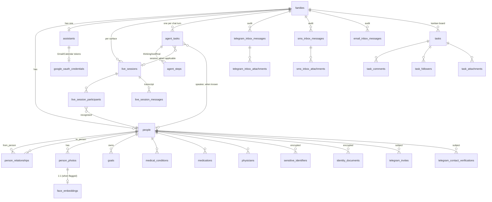

# Data Model

The Family Assistant stores everything in a single Postgres database
(`family_assistant`) managed by Alembic. Every table and column carries
a Postgres `COMMENT` so the read-only `llm_schema_catalog` view is
genuinely useful for dynamic SQL generation by a local LLM. This
document is the human-friendly companion to that catalog.

> All ORM classes live under [`python/api/models/`](../python/api/models).
> Each file is heavily commented with rationale; this document focuses
> on **how the tables fit together**.

---

## Top-level grouping

| Domain | Tables | Purpose |
|---|---|---|
| **Family core** | `families`, `assistants`, `people`, `person_relationships`, `person_photos`, `face_embeddings`, `goals` | Who lives in the household, how they relate, what they care about, and the face gallery used to recognise them on camera. |
| **Health** | `medical_conditions`, `medications`, `physicians` | Per-person medical context Avi can fetch when relevant. |
| **Household assets** | `pets`, `pet_photos`, `residences`, `residence_photos`, `addresses`, `vehicles`, `insurance_policies`, `insurance_policy_people`, `insurance_policy_vehicles`, `financial_accounts`, `documents` | Things the family owns or insures. |
| **Identity (encrypted)** | `identity_documents`, `sensitive_identifiers` | Passports, SSNs, ITINs, etc. Stored as Fernet ciphertext + a plaintext last-four. |
| **AI conversation surfaces** | `live_sessions`, `live_session_participants`, `live_session_messages` | One row per continuous interaction (live, sms, telegram, email) and its transcript. |
| **Inbox audit** | `email_inbox_messages`, `sms_inbox_messages`, `sms_inbox_attachments`, `telegram_inbox_messages`, `telegram_inbox_attachments` | One row per inbound message Avi inspected, with an explicit security verdict (`processed_replied`, `ignored_unknown_sender`, etc.). |
| **Telegram onboarding** | `telegram_invites`, `telegram_contact_verifications` | Deep-link invites + the SMS-2FA challenge that confirms a contact-share before binding `Person.telegram_user_id`. |
| **Tasks (kanban)** | `tasks`, `task_comments`, `task_followers`, `task_attachments` | User-facing household to-do board. Avi can create / update tasks via tools. |
| **Agent audit** | `agent_tasks`, `agent_steps` | One row per agent invocation + per-step transcript (thinking, tool_call, tool_result, final). |
| **External-service credentials** | `google_oauth_credentials` | Fernet-encrypted refresh tokens for Gmail + Calendar. |

Total: **~40 tables** + the `llm_schema_catalog` read-only view.

---

## Tenancy

Every "user data" row is scoped to a single `families.family_id` and
cascades on family delete. The exceptions are the join tables
(`insurance_policy_people`, `insurance_policy_vehicles`) and rows
hanging off another tenant-scoped row (e.g. `person_photos` →
`people` → `families`).

There is **no global user table**. Local single-machine trust is the
auth model today; the `/api/admin/*` vs `/api/aiassistant/*` split
exists so a real auth layer can be plugged in per surface later.

---

## ER diagram — core entities

The diagram below shows just the **identity, household, and AI
conversation** surfaces. Less interesting CRUD tables (assets, health,
identity documents) hang off `families` / `people` the same way.

---

## Family core

### `families`

The top-level tenant. Just an id + display name + free-form notes;
everything else hangs off it. Cascade-deletes everything when removed.

### `assistants`

One row per family. Holds Avi's display name, gender (drives the TTS
voice default), persona/system prompt, and the path to the
Gemini-generated portrait. `1:1` with `families`.

### `people`

Individual household members. Notable columns:

- `first_name`, `last_name`, `preferred_name` — Avi addresses people
  by `preferred_name` if set, otherwise `first_name`.
- `primary_family_relationship` — convenience label only; the
  authoritative tree lives in `person_relationships`.
- `email_address`, `work_email` — also used as Google Calendar ids by
  the calendar tools (personal calendar is full-detail, work calendar
  is typically free/busy only).
- `mobile_phone_number` / `home_phone_number` / `work_phone_number` —
  the SMS surface matches inbound `From:` against all three.
- `telegram_user_id` (`BIGINT`) and `telegram_username` — populated
  either by a deep-link invite claim or by an SMS-verified
  contact-share (see `telegram_contact_verifications`).
- `profile_photo_path` — also used as a face-recognition training
  anchor.

### `person_relationships`

Atomic edges of the family tree. Two types only:

- `parent_of` (directional: `from_person` is the parent, `to_person`
  is the child).
- `spouse_of` (symmetric: stored as **two rows**, A→B and B→A, so
  every UI render can pick one perspective without special-casing).

Siblings, grandparents, aunts/uncles, in-laws, cousins are all
**derived at query time** by graph traversal.

Constraints:

- `UNIQUE(from_person_id, to_person_id, relationship_type)` —
  no duplicate edges.
- `CHECK(from_person_id <> to_person_id)` — no self-edges.
- `CHECK(relationship_type IN ('parent_of', 'spouse_of'))`.

### `person_photos` + `face_embeddings`

`person_photos` stores filesystem paths; the `use_for_face_recognition`
boolean drives whether a `face_embedding` row gets generated. The
embedding row holds:

- a 512-dim float32 vector stored as raw `bytes` (2048 bytes — no
  pgvector dependency, so the app runs on vanilla Postgres),
- denormalised `person_id` and `family_id` for index-only recognition
  queries,
- the model name (`buffalo_l`) for future migration,
- the source bounding box JSON.

Cascade-deletes the embedding when the photo is removed, so the
gallery never drifts out of sync.

### `goals`

Per-person goals (`urgent · high · normal · low · future_idea`). Avi
surfaces them in greetings ("how's that gymnastics meet tomorrow?")
and uses them for follow-up questions.

---

## Health

`medical_conditions`, `medications`, `physicians` — straightforward
per-person CRUD tables. Notes columns are free-form. Nothing here is
encrypted (the family can choose to leave fields blank); SSNs and
similar live in `sensitive_identifiers`.

---

## Household assets

| Table | Notes |
|---|---|
| `pets` (+ `pet_photos`) | Animal type, name, breed, DOB. Photos for face/breed reference. |
| `residences` (+ `residence_photos`) | Owned / rented / vacation / inherited. Linked to `addresses`. |
| `addresses` | Generic postal address, referenced by residences and policies. |
| `vehicles` | VIN + license plate are encrypted (`*_encrypted` + `*_last_four`). Includes registration expiration date Avi proactively surfaces. |
| `insurance_policies` | Carrier, plan, dates, premiums. `policy_number_encrypted` + `policy_number_last_four`. |
| `insurance_policy_people` | M:N — which household members are covered by which policy. |
| `insurance_policy_vehicles` | M:N — which vehicles are covered (auto / classic-auto policies). |
| `financial_accounts` | Bank / brokerage / retirement. `account_number_encrypted`, `routing_number_encrypted`, plus `*_last_four` for safe display. |
| `documents` | Generic document store (PDFs, scans). Optional `person_id` link. |

---

## Identity (encrypted)

### `sensitive_identifiers`

SSN / ITIN / foreign tax ID / "other". Always:

- `identifier_value_encrypted` (Fernet ciphertext)
- `identifier_last_four` (plain text, 4 chars)
- `identifier_type` (string discriminator)

### `identity_documents`

Passports, driver's licenses, green cards, etc. Document number is
encrypted; expiration dates and issuing country are plaintext so Avi
can warn about upcoming expirations and answer "which passports does
the family hold?" without decrypting anything.

---

## AI conversation surfaces

### `live_sessions`

**One row per continuous interaction**, regardless of which surface
opened it. Key columns:

- `source` — `'live' | 'sms' | 'telegram' | 'email'`. Drives the UI
  badge and is part of the per-surface lookup key.
- `external_thread_id` — opaque foreign id for the upstream
  conversation:
  - `live` → `NULL`
  - `sms` → counterparty's E.164 phone
  - `telegram` → chat id (stringified)
  - `email` → Gmail thread id
- `started_at`, `last_activity_at`, `ended_at`, `end_reason`
  (`'timeout' | 'manual' | 'superseded'`).
- Partial unique index on `(family_id, external_thread_id) WHERE
  external_thread_id IS NOT NULL` so the live-page rows don't all
  collide on `NULL`.

Idle policy: the live page closes a session after
`AI_LIVE_SESSION_IDLE_MINUTES` (default 30). Email / SMS / Telegram
sessions stay open across days because `external_thread_id` matching
is what reuses the row.

### `live_session_participants`

Who has appeared in the camera frame during this session and whether
Avi has already greeted them (the `greeted_already` flag prevents
"hi Sam!" repeating every 2.5 s).

### `live_session_messages`

The chat transcript. `role` is one of `LIVE_SESSION_MESSAGE_ROLES`
(user / assistant / system). For the push surfaces (Telegram / SMS),
**both** the fast-ack and the final reply land here as separate
assistant rows with cross-linked metadata, so the audit trail mirrors
what the user actually saw.

---

## Inbox audit

Three structurally identical tables — one per inbound channel — give
the family a tamper-evident receipt of **every message Avi looked at
and what he decided to do about it**. They share the same status
vocabulary (`processed_replied`, `ignored_unknown_sender`,
`ignored_self`, `ignored_already_seen`, `failed`, plus channel-
specific extras), and each one has a `UNIQUE` constraint on the
upstream message id so retries can't double-process.

| Table | Dedup key | Channel-specific statuses |
|---|---|---|
| `email_inbox_messages` | `(assistant_id, gmail_message_id)` | `ignored_bulk` (auto-replies / mailing lists) |
| `sms_inbox_messages` (+ `sms_inbox_attachments`) | `twilio_message_sid` | `ignored_stop` (STOP keyword) |
| `telegram_inbox_messages` (+ `telegram_inbox_attachments`) | `telegram_update_id` | `ignored_non_message` (edits / channel posts), `prompted_for_contact_share` |

`status_reason` is a free-form string for human investigation when
something failed.

---

## Telegram onboarding

Telegram is unique because (a) bots can't initiate conversations and
(b) the contact-share API is the only way for the bot to learn a
sender's phone number.

### `telegram_invites`

Deep-link invites issued by the `telegram_invite` agent tool. Format:
`t.me/<bot>?start=<payload_token>`. Tracks who the invite is for,
who created it, the channel it was delivered through (`sms`, `email`,
`manual`), expiry (default 30 days), and claim metadata.

A **partial unique index** on `(person_id) WHERE claimed_at IS NULL
AND revoked_at IS NULL` guarantees at most one outstanding invite per
person at a time.

### `telegram_contact_verifications`

The SMS second-factor that protects the contact-share auto-link.
Anyone running a custom Telegram client could lie about their phone
number when sharing a contact, so when an unrecognised user shares a
contact that matches a registered `Person.mobile_phone_number` we:

1. Generate a 6-digit code (`generate_verification_code`).
2. Store its `code_hash` (SHA-256, compared with `hmac.compare_digest`).
3. Send the plaintext via Twilio SMS to the matched person's mobile.
4. Wait for the user to echo it back into Telegram inside
   `AI_TELEGRAM_VERIFY_TTL_MINUTES` (default 10) and within
   `AI_TELEGRAM_VERIFY_MAX_ATTEMPTS` (default 5) tries.
5. On success, copy `telegram_user_id` / `telegram_username` onto
   the `people` row and set `claimed_at`.

A **partial unique index** on `(telegram_chat_id) WHERE claimed_at IS
NULL AND revoked_at IS NULL` ensures only one outstanding challenge
per chat at a time. Earlier in-flight challenges are revoked when a
new one is issued.

---

## Tasks (kanban)

Long-lived household to-do items, distinct from the short-lived
`agent_tasks` audit row. The kanban board has four columns
(`new · in_progress · finalizing · done`) and five priorities
(`urgent · high · normal · low · future_idea`).

| Table | Notes |
|---|---|
| `tasks` | Title, description, status, priority, due date, asker / owner / family ids. |
| `task_comments` | `author_kind = 'person' \| 'assistant'`; assistant-authored notes survive when their human author is deleted. |
| `task_followers` | M:N — extra people who get notified on changes. |
| `task_attachments` | Photos / PDFs / docs; `kind` is a coarse "thumbnail vs document chip" UI hint, `mime_type` carries the precise type. |

---

## Agent audit

### `agent_tasks`

**One row per agent invocation** (every chat turn that has tools
available). Holds:

- the user prompt (`input_text`),
- terminal status (`pending → running → succeeded | failed | cancelled`),
- the final assistant reply (`summary`),
- timing (`started_at`, `completed_at`, `duration_ms`),
- which model drove the loop (`model`),
- `kind` — `'chat' | 'research' | 'background'`,
- foreign keys to `live_sessions` (when from the live page) and to
  `people` (recognised speaker, when known).

### `agent_steps`

Append-only per-step transcript. `step_type` is one of:

- `thinking` — model produced reasoning text but no tool call,
- `tool_call` — model requested a tool execution (`tool_name`,
  `tool_input` JSONB),
- `tool_result` — we executed it (`tool_output` JSONB, `content`
  human-readable summary),
- `final` — final user-facing answer streamed at end of run,
- `error` — uncaught failure inside the loop.

Replaying the rows in `step_index` order reproduces the run. The
admin "agent runs" page hangs off this table.

---

## External-service credentials

### `google_oauth_credentials`

One row per `assistant`. Stores the full
`google.oauth2.credentials.Credentials` payload (refresh_token,
access_token, token URI, client id/secret, scopes, expiry) as a
**single Fernet-encrypted JSON blob**. That makes key rotation a
straightforward read-decrypt-encrypt-write loop with no schema
change.

The plaintext columns are intentional:

- `granted_email` — so the admin UI can show "Connected as
  avi@example.com" without decrypting anything.
- `scopes` — so we can answer "do we have Calendar access?" cheaply.
- `token_expires_at` — so the refresh logic can decide whether to
  mint a new access token before the next API call.

The refresh token never appears in the API response or any log line.

---

## Encryption pattern

Wherever a column is sensitive enough that a leak would matter (SSN,
account numbers, policy numbers, VINs, license plates, ID document
numbers, OAuth refresh tokens), the table follows this pattern:

| Column | Type | Visibility |
|---|---|---|
| `<thing>_encrypted` | `bytea` | Fernet ciphertext. Never returned from the API, never logged, never used in a SQL filter. |
| `<thing>_last_four` (or `granted_email` / `scopes` for OAuth) | `text` / `varchar` | Plaintext display + filter. The LLM writes `WHERE policy_number_last_four = '1234'` instead of touching the ciphertext. |

Decryption happens in **exactly one place per surface**: the relevant
admin router for "show me this row" requests, and the `reveal_secret`
/ `reveal_sensitive_identifier` agent tools (which themselves go
through `ai/authz.py` so only the right speakers can call them).

---

## Conventions cheat sheet

- **Naming.** Verbose snake_case. The LLM's system prompt mentions
  `llm_schema_catalog` and the model can browse it on demand.
- **Comments.** Every table and every non-trivial column has a
  Postgres `COMMENT`. The Pydantic-validated `description=...` on the
  ORM `mapped_column(...)` propagates into the Alembic migration.
- **Enums.** Stored as plain `String` columns guarded by
  `CheckConstraint`, never as Postgres `ENUM` types — adding a new
  value is a tuple change + migration `op.create_check_constraint(...)`,
  not a fragile `ALTER TYPE`.
- **Partial unique indexes.** Used wherever "at most one **active**
  row per X" is the rule (telegram_invites, telegram_contact_verifications,
  live_sessions external thread). Inactive rows (claimed / revoked / NULL)
  never collide.
- **Cascades.** All "owned" relationships use `ON DELETE CASCADE` so
  removing a `family` cleanly removes everything else. Optional
  back-references (e.g. `agent_tasks.live_session_id`) use
  `ON DELETE SET NULL`.
- **Timestamps.** Every table mixes in `TimestampMixin` (`created_at`,
  `updated_at` with server-side defaults).
